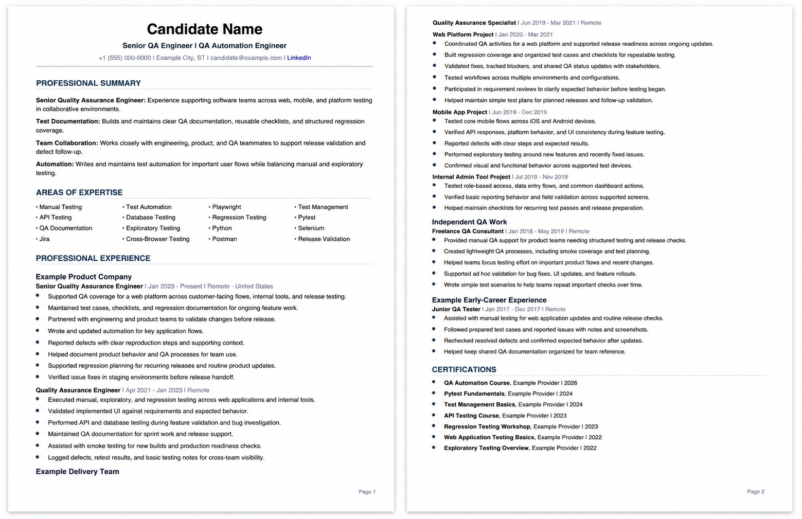

# resume-creator

<p align="center">
  
  
  
  
</p>

<p align="center">
  <em>ATS systems filter you out before a human ever sees your name.</em><br>
  <strong>This skill builds a resume engineered to get through — and impress when it lands.</strong>
</p>

---

## What Is This

`resume-creator` is a Claude Code skill that guides you through building a complete, ATS-optimized 2-page resume from scratch. It follows 2026 resume methodology and outputs both a ready-to-edit markdown source and a styled PDF.

What it does:

- **Gathers your info** through a structured intake (job target, achievements, work history, contact info)
- **Extracts keywords** from your target job posting into a 4-column Areas of Expertise grid — the primary ATS injection point
- **Writes your Professional Summary** in titled-sentence style: each sentence leads with a bold keyword topic backed by real metrics
- **Crafts every bullet** using the Badass Bullet Point Formula: `Action Verb + Specific Detail + Result`
- **Generates a styled PDF** via a bundled Python script — no browser, no Puppeteer, no dependencies beyond ReportLab

## What You Get

| Output | Description |
|--------|-------------|
| `[name]-resume-ats.md` | ATS-clean markdown source — easy to edit and version-control |
| `[name]-resume.pdf` | Styled 2-page PDF ready to attach to applications |

**Resume structure:**
- Name + dual titles (target 2 role types at once)
- Professional Summary (3–5 titled sentences, metrics-first)
- Areas of Expertise (4-column keyword grid, 12–16 terms)
- Professional Experience (Badass Bullet formula, 3-tier hierarchy: company → role → sub-project)
- Certifications

## Output Example



## Quick Start

**1. Install the skill**

```bash
cp -r resume-creator ~/.claude/skills/
```

**2. Restart Claude Code**, then trigger:

```
/resume-creator
```

Claude will ask you for your target job, achievements, work history, and contact info — then build the full resume.

**3. Generate the PDF**

```bash
# One-time setup
python3 -m venv .venv && .venv/bin/pip install reportlab --quiet

# Generate
.venv/bin/python scripts/generate_resume_pdf.py \
  --source your-name-resume-ats.md \
  --output your-name-resume.pdf
```

## How It Works

```
/resume-creator
      │
      ▼
┌─────────────────────┐
│  Step 1: Intake     │  Job target, achievements, history, contact info
└──────────┬──────────┘
           │
┌──────────▼──────────┐
│  Step 2: Keywords   │  Extract from job posting → 4-column AoE grid
└──────────┬──────────┘
           │
┌──────────▼──────────┐
│  Step 3: Summary    │  Titled-sentence style, metrics-first, no fluff
└──────────┬──────────┘
           │
┌──────────▼──────────┐
│  Step 4: Experience │  Badass Bullet Formula per role
└──────────┬──────────┘
           │
┌──────────▼──────────┐
│  Step 5: Assemble   │  Full markdown → [name]-resume-ats.md
└──────────┬──────────┘
           │
┌──────────▼──────────┐
│  Step 6: PDF        │  Python + ReportLab → styled 2-page PDF
└─────────────────────┘
```

## ATS Rules Built In

- No tables, columns, text boxes, or graphics in the resume body
- Keywords pulled from the actual job posting — not generic
- Every bullet in the top role includes a number or concrete outcome
- Exactly 2 pages — not compressed to 1, not allowed to spill to 3

## Project Structure

```
resume-creator/
├── SKILL.md                     # Skill definition and full methodology
└── scripts/
    └── generate_resume_pdf.py   # Python PDF generator (ReportLab)
```

## Tech Stack

- **Agent**: Claude Code skill (`/resume-creator`)
- **PDF**: Python + ReportLab (no headless browser required)
- **Fonts**: Helvetica (built into ReportLab — no downloads)
- **Source format**: Markdown (version-controllable, ATS-safe)

## About the Author

I'm Demian — Senior QA Engineer with 5+ years in e-commerce SaaS, test automation, and AI-assisted workflows. I built this skill while creating my own resume and wanted to package the methodology so others can use it too.

[](https://www.linkedin.com/in/demian-vyrozub)

## License

MIT — use it, fork it, improve it.
